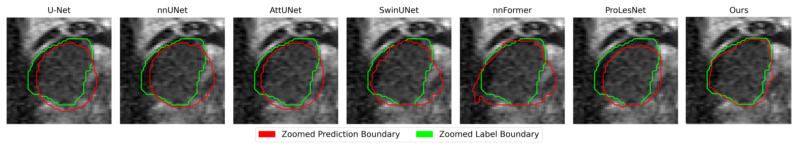

# Boundary-Refined Prostate Lesion Segmentation in T2-Weighted MRI via Learnable Edge-Aware Attention and Nested Output Fusion

This repository contains the official PyTorch implementation of **Boundary-Refined Prostate Lesion Segmentation in T2-Weighted MRI via Learnable Edge-Aware Attention and Nested Output Fusion Paper**, a novel architecture designed for boundary-aware and efficient prostate lesion segmentation using only T2-weighted MRI. Our model incorporates:

- A **lightweight Encoder & Residual decoder**
- A novel **Learnable Multi-Scale Edge-Aware Spatial Attention Gate (LEASAG)**
- Deeply supervised **nested** decoding scheme wherein **intermediate outputs at different scales are fused through a learnable fusion block**. By optimally combining multi-resolution predictions, this strategy enhances training convergence and produces a more robust final segmentation
- **Single-modality training (T2W only)** suited for real-world clinical constraints

> 📢 This work has been submitted to **CVIP 2025**.

---

## 🧠 Highlights

- Outperforms ProLesNet, Attention U-Net, nnUNet, SwinUNet, nnFormer on the **Prostate158** csPCa 82 (Gleason score >=1) external evaluation dataset
- Requires only T2W MRI, making it practical for deployment in low-resource or misaligned settings
- Achieves **state-of-the-art Dice, HD, and Precision** among T2W-only methods

---

## 📊 Results Summary (External Prostate158 Dataset)

| Model           | Dice (%)  | HD (mm)   | Precision (%) | Recall (%) |
| --------------- | --------- | --------- | ------------- | ---------- |
| U-Net           | 17.26     | 24.73     | 25.03         | 16.54      |
| V-Net           | 22.32     | 21.56     | 39.14         | 18.25      |
| nnUNet          | 20.02     | 23.21     | 35.04         | 19.21      |
| Attention U-Net | 29.43     | 19.55     | 42.29         | 27.75      |
| Swin U-Net      | 19.05     | 23.22     | 31.10         | 20.32      |
| nnFormer        | 23.81     | 21.03     | 34.16         | 22.29      |
| ProLesNet       | 30.22     | 19.89     | 42.17         | 29.25      |
| Ours (EASAG)    | **35.17** | **18.43** | **42.66**     | **35.18**  |


---

## 📦 Model Architecture


## 🧪 Training Instructions

1. **Download the datasets:**

   * [PI-CAI dataset](https://pi-cai.grand-challenge.org/DATA/)
   * [Prostate158 dataset](https://zenodo.org/record/6481141)

2. **Set up folder structure:**

```bash
data/
├── picai/
│   ├── T2W/
│   └── labels/
├── prostate158/
│   ├── T2W/
│   └── labels/
```

3. **For Training & Evaluation the model:**

Follow the steps which I have mentioned above

---

## 📷 Qualitative Visualizations



---

## 📷 Qualitative Visualizations

We provide qualitative comparisons with other baselines (U-Net, ProLesNet, nnUNet, etc.) and landmark predictions `/visuals`.

---

---

## 🤝 Contact

If you find this work helpful or have questions:

* ✉️ Email: [ramvikash11111@gmail.com]

---
